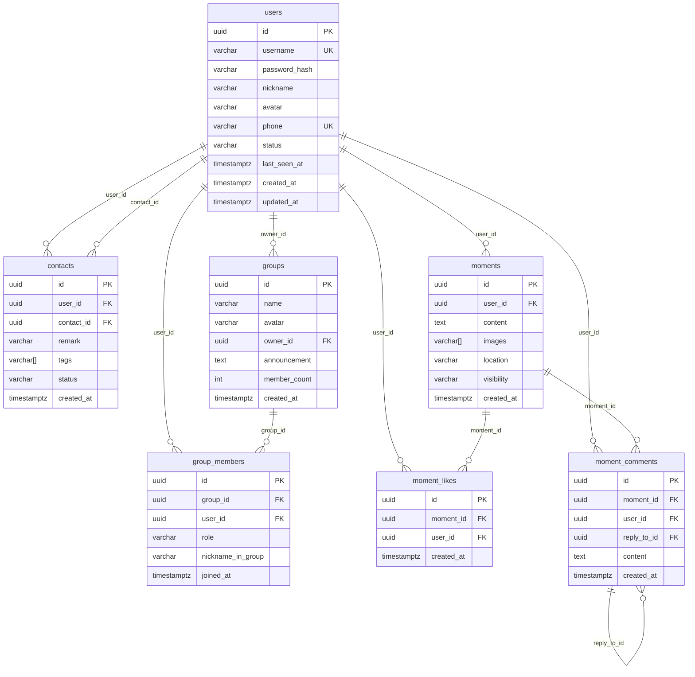
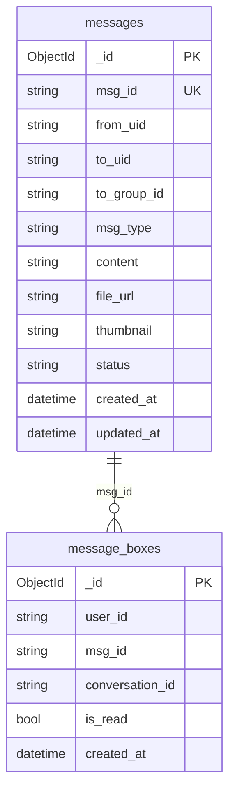

# WeChat Clone — ER Diagram

## PostgreSQL Schema

## Relationships Summary

| Parent | Child | Type | FK | On Delete |
|--------|-------|------|----|-----------|
| users | contacts | 1:N | user_id, contact_id | CASCADE |
| users | groups | 1:N | owner_id | CASCADE |
| users | group_members | 1:N | user_id | CASCADE |
| groups | group_members | 1:N | group_id | CASCADE |
| users | moments | 1:N | user_id | CASCADE |
| users | moment_likes | 1:N | user_id | CASCADE |
| moments | moment_likes | 1:N | moment_id | CASCADE |
| users | moment_comments | 1:N | user_id | CASCADE |
| moments | moment_comments | 1:N | moment_id | CASCADE |
| moment_comments | moment_comments | self-ref | reply_to_id | SET NULL |

## 3NF Compliance Notes

All tables satisfy Third Normal Form (3NF):

1. **1NF (Atomic)**: All columns contain atomic values. PostgreSQL arrays (`tags`, `images`) are atomic in the relational model — the DB treats them as single values with array operators.

2. **2NF (No partial dependency)**: All tables have UUID single-column primary keys, so no partial dependency is possible.

3. **3NF (No transitive dependency)**: Non-key columns depend only on the primary key:
   - In `moments`, `location` depends on `id`, not on `user_id`
   - In `contacts`, `tags` depends on the contact relationship (`id`), not transitively through `user_id`
   - In `group_members`, `role` depends on the membership itself, not on `user_id` or `group_id` alone

## MongoDB Collection Design

## Redis Key Design

| Key Pattern | Type | TTL | Purpose |
|---|---|---|---|
| `wc:session:{token}` | STRING | 7d | User session |
| `wc:user:online:{uid}` | STRING | 30s | Online heartbeat |
| `wc:ws:conn:{uid}` | HASH | — | WebSocket connection info |
| `wc:group:members:{gid}` | SET | — | Group member cache |
| `wc:user:profile:{uid}` | HASH | 1h | User profile cache |
| `wc:user:recent:{uid}` | ZSET | — | Recent contacts list |
| `wc:user:offline:{uid}` | LIST | — | Offline message queue |
| `wc:rate:{action}:{id}:{window}` | STRING | window | Rate limiting |
| `wc:lock:{resource}` | STRING | — | Distributed lock |
